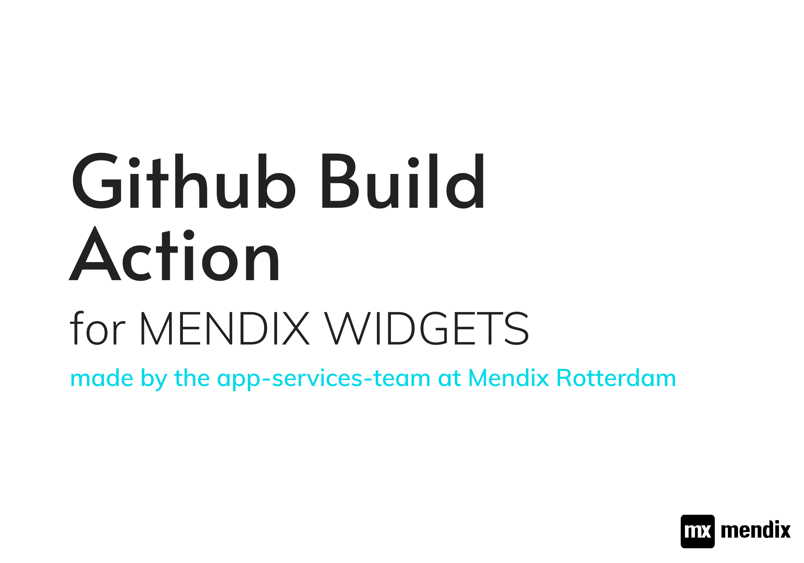

<br/>
This Action was written to keep package.json and package.xml in sync with each other, The action will also build the Widget and upload it as a release.

See the a Mono Repo Action see in Action [here](https://github.com/mendixlabs/app-services-components)

See the Mono Repo Action see [here](https://github.com/ahwelgemoed/mendix-widget-build-action-monorepo)

## Setup

Here is an example

```yml
name: Build-The-Package
on:
  push:
    branches:
      - main
jobs:
  widget-build-action:
    runs-on: ubuntu-latest
    steps:
      - uses: actions/checkout@v2
      - name: Use Node.js
        uses: actions/setup-node@v1
        with:
          node-version: "12.x"
      - name: Install dependencies
        run: |
          npm install
        ##   Here is this Action
      - uses: ahwelgemoed/widget-build-monorepo-action@main
        with:
          author_name: build-bot
          branch_to_push_to: main
          GITHUB_TOKEN: ${{ secrets.GITHUB_TOKEN }}
          bot_commit_message: bot-version-match
          bot_author_name: build-bot
          bot_author_email: build-bot@mendix.com
```

## How it works

You build or patch your widget, locally you lint and test it. If you are happy that there are no errors. (You don't have to push the Build, the action will do it, just make sure you can build the widget successfully)

Next update your `package.json` version to the next logical version (1.0.0 => 1.0.1 for example), commit and push you code.

This will do multiple things:

- Update the version in your `package.xml`
- Push a Tag and a Release
- It will also push that code

### The acton steps are as follow (Internal Workings of the Action)

---

- Builds a helper object with all paths it will need

- Reads the package's `package.json`

  - Saves package name and version

- Parses `package.xml` and makes it into a js object

  - Saves the version

- Sees if the `package.json` and `package.xml` matches, if it does not match the code continues.

- Initialize Git and set Credentials

- Runs `npm build` and builds the package

- Change `package.xml` version to what ever the `package.json` was.

- Create a Tag Name

- Create a Tag on the Git Repo

- Commits Changes to Github

- Converts Tag to Release

- Uploads Build to Release

- Done

## Some things to Note

As the action will change the package.xlm and upload the build, you will always have changes in your git working tree. so make sure to pull your code when done as the bot has committed some changes

## 🛑 Issues && Known Limits

- If the Widget does not build successfully through either a lint or ts error it the action will fall over.
